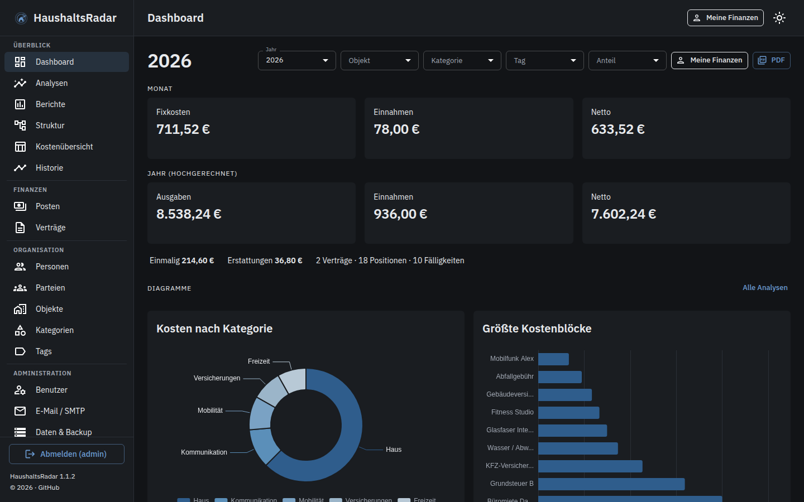

# HaushaltsRadar

Selbst gehostete Web-App für **Fixkosten, Verträge und wiederkehrende Ausgaben** im Haushalt – inklusive Einnahmen, Analysen und Periodenberichten.

HaushaltsRadar ist **kein** klassisches Haushaltsbuch und **keine** Banking-Software. Es modelliert Fixkosten, Abos, Versicherungen und ähnliche Positionen, verteilt sie auf Personen/Parteien und macht sie über Dashboards und Diagramme nachvollziehbar.




*Screenshots zeigen fiktive Demo-Daten (`docs/demo/screenshot-demo-data.json`), keine Echtdaten.*

## Funktionen

| Bereich | Was du damit machst |
|---------|---------------------|
| **Dashboard** | Monatliche und hochgerechnete Jahres-KPIs (Ausgaben, Einnahmen, Netto), Kategorie- und Top-Kosten-Charts, Parteienvergleich, Fälligkeiten |
| **Analysen** | Verteilung, Vergleich, Verlauf, Hierarchie, Heatmap und Flussdiagramme – filterbar nach Objekt, Kategorie, Tag, Person, Partei |
| **Berichte** | Periodenberichte (Monat, Quartal, Halbjahr, Jahr, Zeitraum) mit PDF-Export |
| **Posten** | Ausgaben & Einnahmen, Intervalle (monatlich bis jährlich, einmalig, custom), Anteile, Tags, Objekte |
| **Verträge** | Beginn + Laufzeit (Ende berechnet), Auto-Verlängerung mit eigener Frist, Verknüpfung zu Posten |
| **Organisation** | Personen, Parteien, Objekte, Kategorien, Tags |
| **Meine Finanzen** | Persönliche Sicht über verknüpfte Person (User ↔ Person) |
| **Mein Konto** | Self-Service: E-Mail, Benutzername, Passwort (alle Rollen) |
| **Historie / Struktur / Übersicht** | Kostenverlauf, Strukturansicht und tabellarische Kostenübersicht |
| **Administration** | Benutzer & Rollen, SMTP-Erinnerungen (inkl. Passwort vergessen), JSON-Export/Import & Backup |
| **Anmeldung** | Angemeldet bleiben, optional Passwort vergessen bei aktivem SMTP |
| **PWA** | Als Progressive Web App nutzbar (Light/Dark Mode) |


## Schnellstart

Voraussetzungen: Docker und Docker Compose.

```bash
git clone https://github.com/TimUx/HaushaltsRadar.git
cd HaushaltsRadar
cp .env.example .env
# SECRET_KEY und Bootstrap-Passwort in .env anpassen
export HAUSHALTSRADAR_VERSION=1.1.6   # oder latest
docker compose up -d
```

`docker-compose.yml` nutzt die vorgebauten Images aus GHCR (`linux/amd64`, `linux/arm64`):

- `ghcr.io/timux/haushaltsradar-backend`
- `ghcr.io/timux/haushaltsradar-frontend`

| Dienst | URL |
|--------|-----|
| Frontend | http://localhost:3080 |
| API / OpenAPI | http://localhost:8000/docs |

Standard-Login (änderbar in `.env`): **`admin` / `admin`**

Optionale Demo-Daten: `SEED_SAMPLE_DATA=true` in `.env` (Standard in `.env.example`).

Lokale Entwicklung mit Hot-Reload: `docker compose -f docker-compose.dev.yml up --build`

## Dokumentation

| Guide | Für wen |
|-------|---------|
| [Benutzerhandbuch](docs/guides/USER.md) | Alltag: Posten, Filter, Analysen, Berichte |
| [Admin-Guide](docs/guides/ADMIN.md) | Benutzer, Backup, Deployment, Sicherheit |
| [Developer-Guide](docs/guides/DEVELOPER.md) | Architektur, lokale Entwicklung, API, Tests |

## Stack

| Schicht | Technologie |
|---------|-------------|
| Backend | Python, FastAPI, SQLAlchemy, Alembic, PostgreSQL, Pydantic |
| Frontend | React, TypeScript, Vite, Material UI, TanStack Query, Apache ECharts, jsPDF |
| Deploy | Docker Compose + GHCR |

## Zugriffsmodell

| Rolle | Rechte |
|-------|--------|
| **viewer** | Lesen: Dashboard, Analysen, Berichte, Übersichten |
| **user** | Zusätzlich: Posten, Verträge, Stammdaten pflegen |
| **admin** | Zusätzlich: Benutzerverwaltung, SMTP, Datenexport/-import & Backup |

## Lizenz

MIT – siehe [LICENSE](LICENSE).
