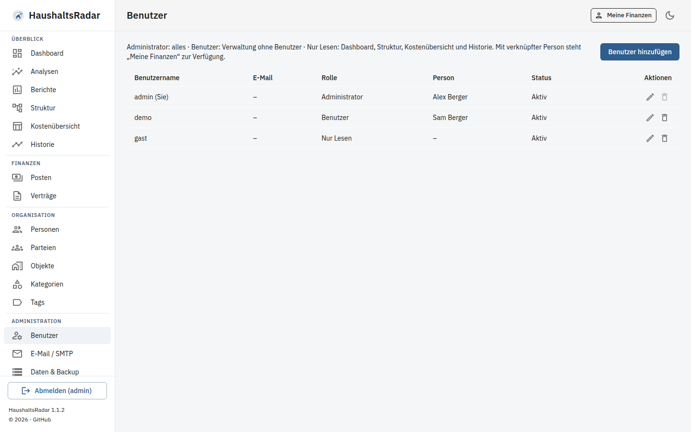
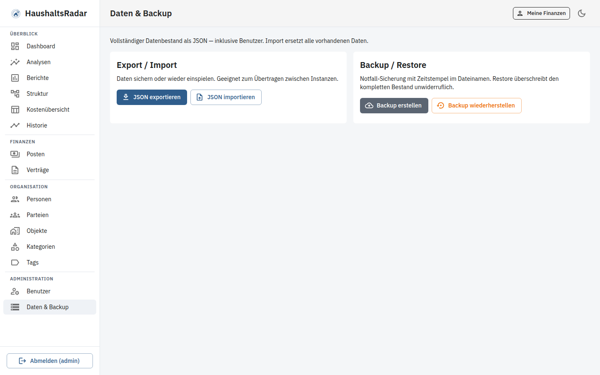

# Admin-Guide – KostenPilot

Anleitung für Betrieb, Benutzerverwaltung und Datensicherung.

*Screenshots zeigen fiktive Demo-Daten.*

## Installation (Produktion / Homelab)

```bash
git clone https://github.com/TimUx/KostenPilot.git
cd KostenPilot
cp .env.example .env
```

In `.env` mindestens setzen:

| Variable | Hinweis |
|----------|---------|
| `SECRET_KEY` | Langer Zufallswert (JWT) |
| `BOOTSTRAP_ADMIN_USERNAME` / `BOOTSTRAP_ADMIN_PASSWORD` | Erster Admin – **nicht** `admin`/`admin` belassen |
| `POSTGRES_*` | Starke DB-Passwörter |
| `CORS_ORIGINS` | Erlaubte Frontend-Origins (inkl. deiner öffentlichen URL) |
| `SEED_SAMPLE_DATA` | `false` in Produktion, sofern keine Demo-Daten gewünscht |

Start (lokaler Build):

```bash
docker compose up --build -d
```

Oder mit vorgebauten Release-Images aus GHCR:

```bash
export KOSTENPILOT_VERSION=1.0.0   # ohne führendes v, oder latest
docker compose -f docker-compose.ghcr.yml up -d
```

Images: `ghcr.io/timux/kostenpilot-backend` und `ghcr.io/timux/kostenpilot-frontend`  
Werden automatisch gebaut, sobald ein GitHub-Release veröffentlicht wird (Workflow `.github/workflows/release-ghcr.yml`).

Nach dem ersten Push sind GHCR-Packages oft **privat**. Unter GitHub → Packages → jeweiliges Package → *Package settings* → Visibility auf **Public** stellen (sonst brauchen Nutzer `docker login ghcr.io`).

- Frontend: Port **3080** (Container-Port 80)
- Backend/API: Port **8000**
- PostgreSQL: Port **5432** (nur bei Bedarf nach außen öffnen)

OpenAPI: `http://<host>:8000/docs`

Reverse Proxy (nginx/Caddy/Traefik) empfohlen: TLS terminieren und Frontend + `/api` zusammenführen.

Nach dem Start erreichst du die Anmeldung unter dem Frontend-Port:


## Rollenmodell

| Rolle | Dashboard / Analysen / Berichte | Stammdaten & Posten | Benutzer & Backup |
|-------|----------------------------------|---------------------|-------------------|
| `viewer` | ja | nein | nein |
| `user` | ja | ja | nein |
| `admin` | ja | ja | ja |

Es muss immer mindestens ein aktiver Admin existieren; die App verhindert das Deaktivieren/Herabstufen des letzten Admins.

## Benutzerverwaltung

Pfad: **Administration → Benutzer**

- Benutzer anlegen, Rolle setzen, aktivieren/deaktivieren
- Optional: Benutzer mit einer **Person** verknüpfen → der User kann **Meine Finanzen** nutzen
- Passwörter nur über die Admin-UI bzw. API setzen (kein Klartext in der DB)



## Daten & Backup

Pfad: **Administration → Daten & Backup**

| Aktion | Wirkung |
|--------|---------|
| **Export** | JSON-Download des Datenbestands |
| **Backup** | wie Export, mit datiertem Dateinamen |
| **Import / Restore** | ersetzt den **gesamten** Datenbestand inkl. Benutzer |

Vor Import/Restore immer ein frisches Backup herunterladen. Restore ist destruktiv und erfordert Bestätigung in der UI.



API (Admin-JWT):

- `GET /api/v1/admin/export`
- `POST /api/v1/admin/import`

## Organisation vorbereiten

Vor dem ersten produktiven Posten empfiehlt sich diese Reihenfolge (siehe auch [Benutzerhandbuch](USER.md)):

1. **Personen** und optional **Parteien** anlegen  
2. **Objekte** zuordnen  
3. Benutzer mit Personen verknüpfen  


## Betrieb & Wartung

```bash
# Logs
docker compose logs -f backend frontend

# Stoppen / Starten
docker compose down
docker compose up -d

# Volume (PostgreSQL-Daten)
# docker volume ls | grep kostenpilot
```

Updates:

```bash
git pull
docker compose up --build -d
```

Migrationen laufen über Alembic beim Backend-Start bzw. manuell (`alembic upgrade head`). Details: [Developer-Guide](DEVELOPER.md).

## Sicherheit – Checkliste

- [ ] `SECRET_KEY` und Admin-Passwort geändert
- [ ] `SEED_SAMPLE_DATA=false` in Produktion
- [ ] PostgreSQL nicht ungeschützt im Internet
- [ ] HTTPS vor die App legen
- [ ] `CORS_ORIGINS` auf echte Frontends beschränken
- [ ] Regelmäßige JSON-Backups (Download oder Cron gegen die Export-API)
- [ ] Viewer-Accounts für reine Leserechte nutzen

## Typische Admin-Aufgaben nach dem ersten Start

1. Admin-Passwort ändern / eigenen Admin anlegen, Demo-Admin deaktivieren
2. Personen, Objekte und Parteien anlegen
3. Benutzer anlegen und ggf. mit Personen verknüpfen
4. Kategorien prüfen (Seed vorhanden), Tags nach Bedarf
5. Erste Posten und Verträge erfassen
6. Backup testen (Export → Restore in einer Testinstanz)
