# Benutzerhandbuch – HaushaltsRadar

Kurzanleitung für den Alltag mit HaushaltsRadar. Für Installation und Benutzerverwaltung siehe den [Admin-Guide](ADMIN.md).

*Screenshots zeigen fiktive Demo-Daten.*

## Anmeldung

1. Öffne die App (Standard: http://localhost:3080).
2. Melde dich mit deinem Benutzernamen und Passwort an.
3. Nach dem Login landest du auf dem **Dashboard**.

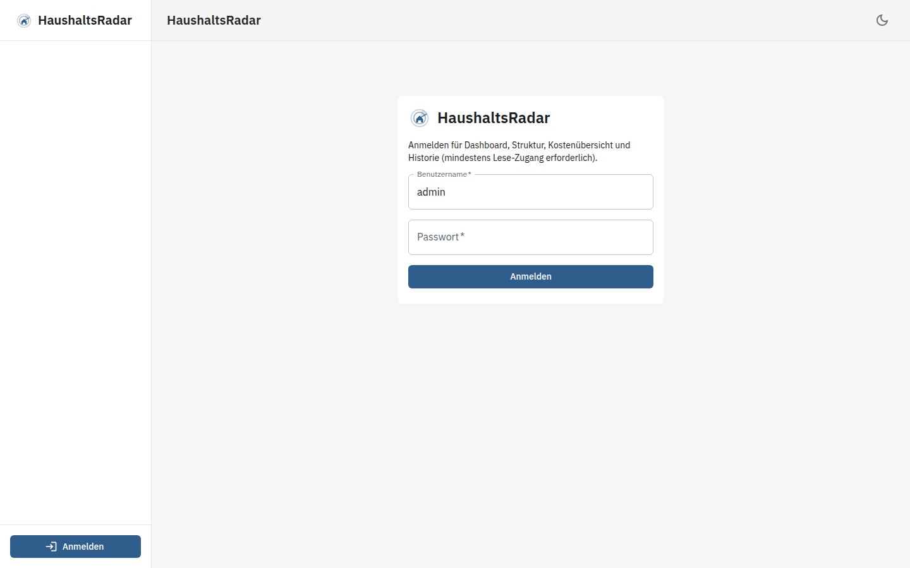

Rollen: **viewer** (nur lesen), **user** (Daten pflegen), **admin** (zusätzlich Verwaltung). Die Menüpunkte richten sich nach deiner Rolle.

## Dashboard

Das Dashboard zeigt den aktuellen Überblick:

- **Monat**: Fixkosten, Einnahmen und Netto des betrachteten Monats
- **Jahr (hochgerechnet)**: aus wiederkehrenden Positionen abgeleitete Jahreswerte plus YTD-Hinweise
- Diagramme zu Kategorien und größten Kostenblöcken
- Vergleich nach Parteien (falls angelegt)
- Liste der nächsten **Fälligkeiten**

Oben kannst du nach **Jahr**, **Objekt**, **Kategorie**, **Tag** und **Anteil** filtern. PDF exportiert die aktuelle Dashboard-Ansicht.

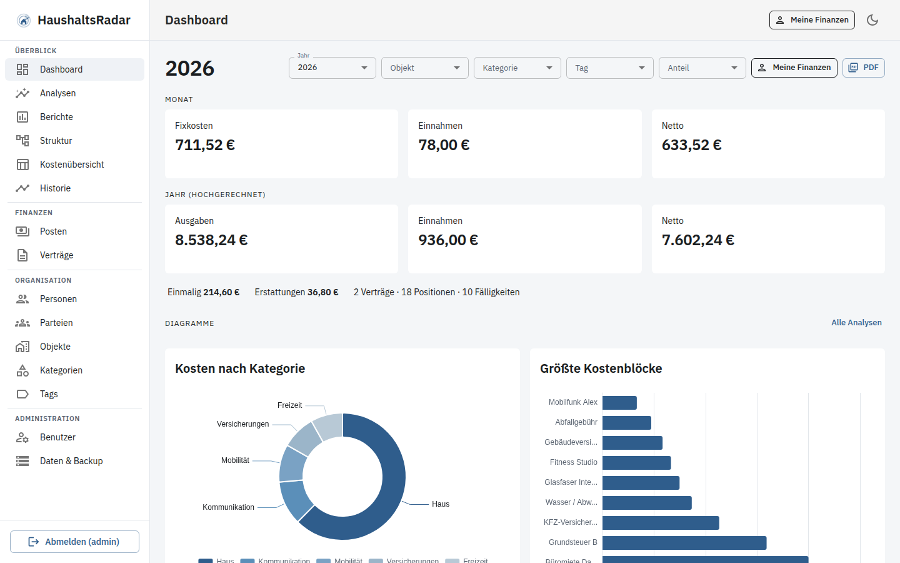

### Meine Finanzen

Wenn dein Benutzerkonto mit einer **Person** verknüpft ist (macht der Admin), blendet **Meine Finanzen** nur die Anteile ein, die auf dich entfallen. So siehst du deine persönlichen Fixkosten statt der gesamten Haushaltsansicht.

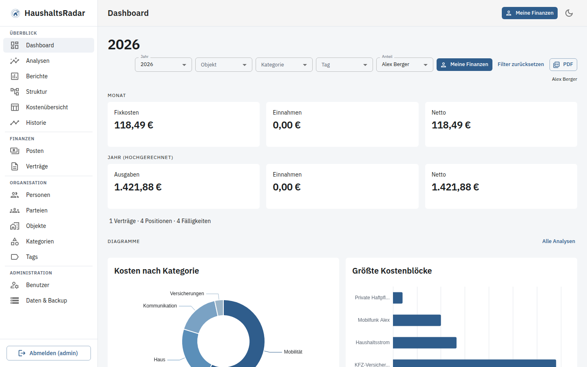

## Analysen

Unter **Analysen** stehen verschiedene Diagrammtypen bereit:

| Typ | Nutzen |
|-----|--------|
| Verteilung | Anteile (z. B. nach Kategorie) |
| Vergleich | Gruppen nebeneinander |
| Verlauf | Entwicklung über die Zeit |
| Hierarchie | Verschachtelte Kostenstruktur |
| Heatmap | Intensität über Dimensionen |
| Fluss | Geldflüsse (Sankey) |

Gruppierung und Filter helfen, z. B. Kosten nach Person, Objekt oder Tag zu vergleichen.

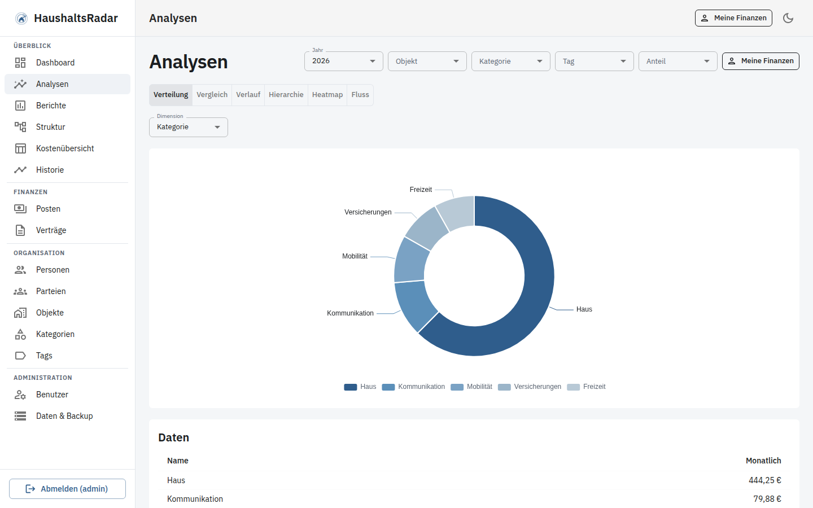

## Berichte

Unter **Berichte** wählst du einen Zeitraum:

- Monat, Quartal, Halbjahr, Jahr oder freier Zeitraum

Die Seite zeigt Kennzahlen und Aufschlüsselungen für die gewählte Periode. Über den PDF-Export kannst du den Bericht speichern oder weitergeben.

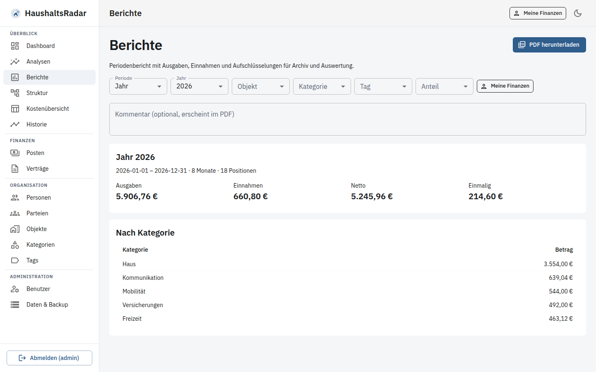

## Posten (Kosten & Einnahmen)

Unter **Finanzen → Posten** legst du Positionen an und bearbeitest sie.

Typische Felder:

- **Name**, Betrag, Währung
- **Art**: Ausgabe oder Einnahme
- **Intervall**: monatlich, zweimonatlich, viertel-/halbjährlich, jährlich, einmalig oder eigenes Intervall
- **Fälligkeit** (Tag / Monat je nach Intervall)
- **Kategorie / Unterkategorie**, Tags, Objekt
- **Verteilung** (Anteile auf Haushalt, Personen oder Parteien)

Wiederkehrende Beträge werden intern auf Monatsäquivalente umgerechnet. **Einmalige** Posten fließen in den Monat ihres Startdatums ein und erhöhen nicht die laufenden Fixkosten.

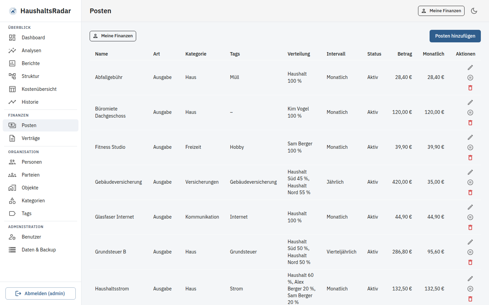

## Verträge

Unter **Verträge** pflegst du Vertragsstammdaten und verknüpfst sie mit Posten. So bleiben Laufzeiten und zugehörige Kosten nachvollziehbar.

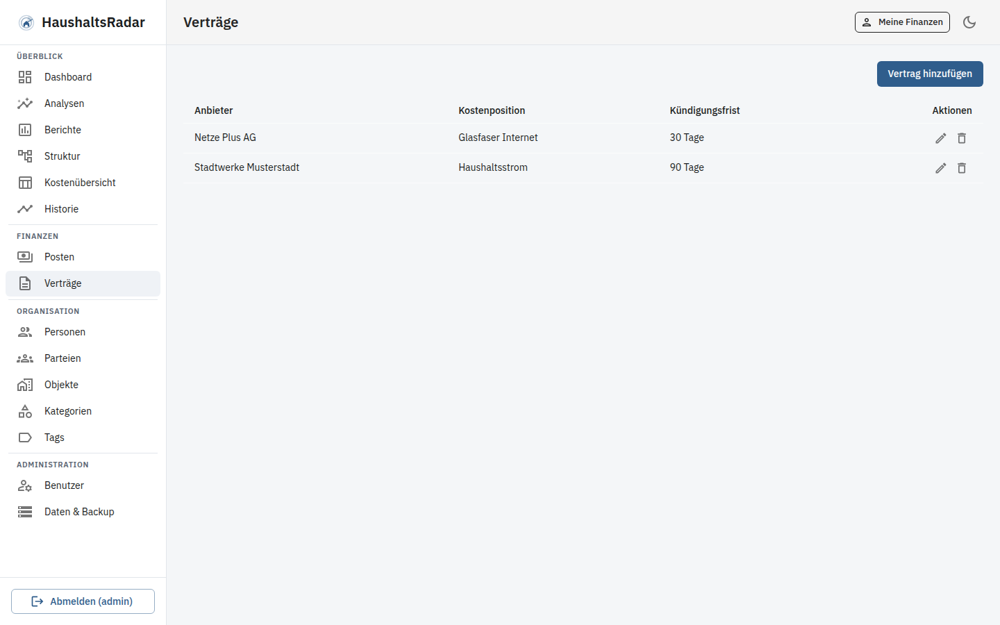

## Organisation

| Seite | Zweck |
|-------|--------|
| **Personen** | Haushaltsmitglieder für Anteile und „Meine Finanzen“ |
| **Parteien** | Gruppen (z. B. Wohnungen/Einheiten) für Vergleiche |
| **Objekte** | Häuser, Wohnungen, Fahrzeuge usw. |
| **Kategorien** | Struktur für Auswertungen (inkl. Unterkategorien) |
| **Tags** | Freie Labels für Filter und Diagramme |

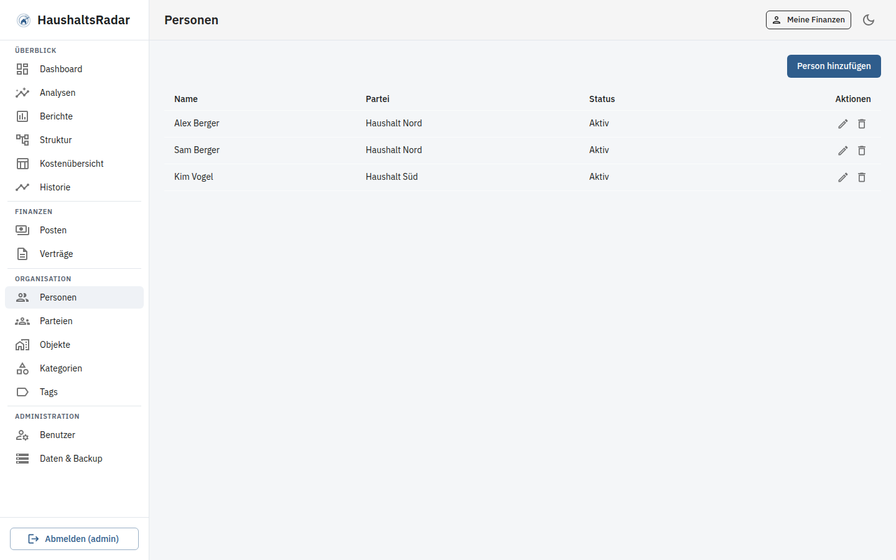

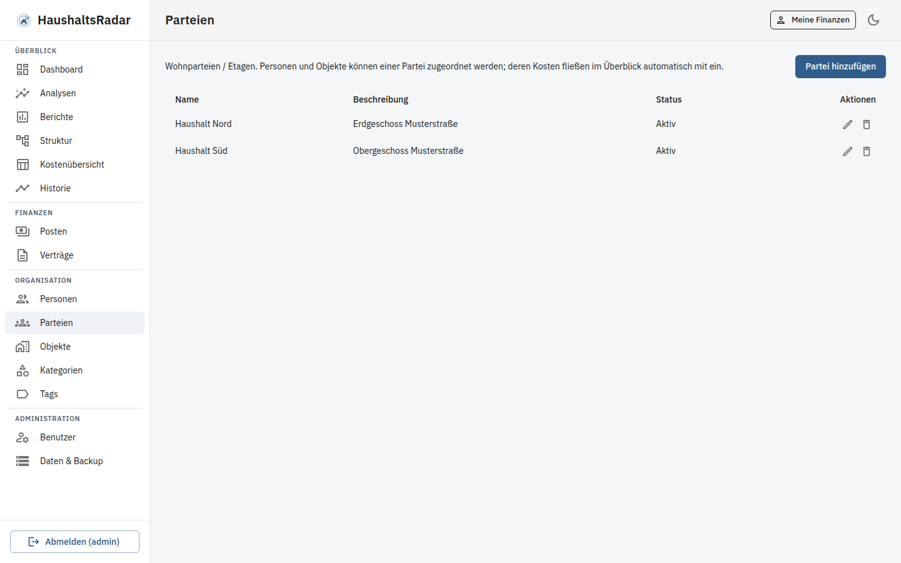

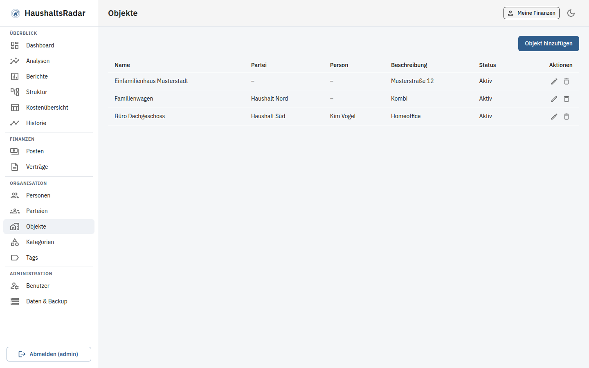

## Weitere Übersichten

- **Struktur** – hierarchische Darstellung der Kosten
- **Kostenübersicht** – tabellarische Liste mit Filtern
- **Historie** – Verlauf und Änderungen über die Zeit

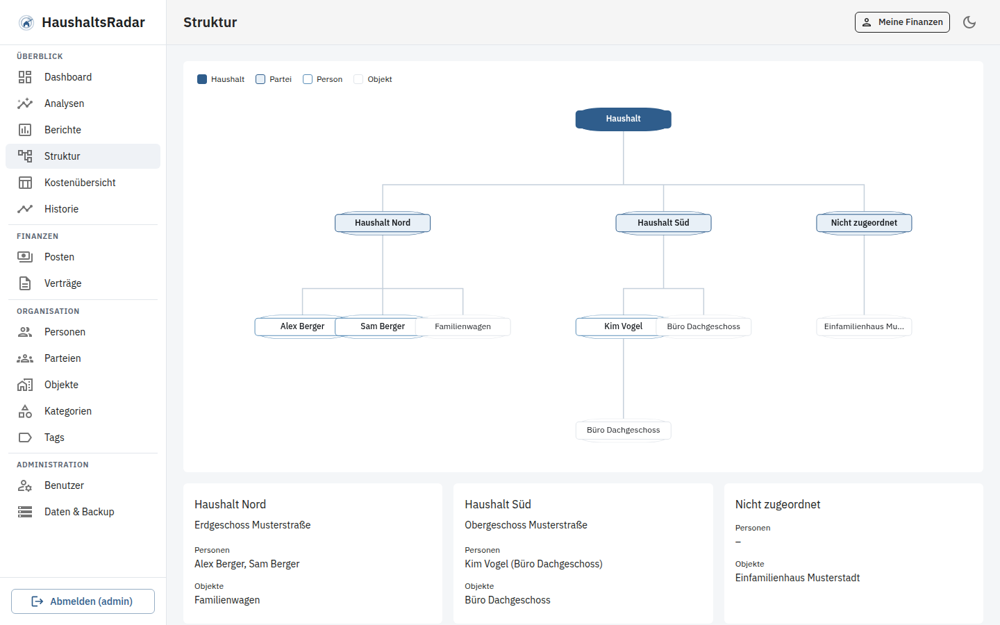

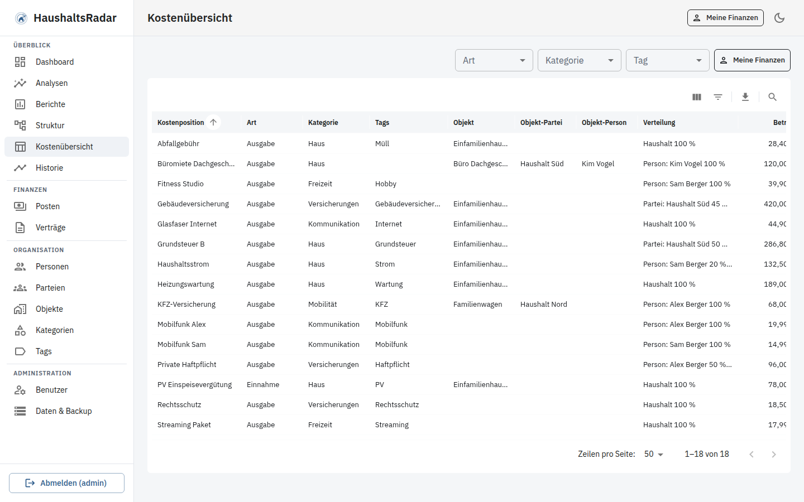

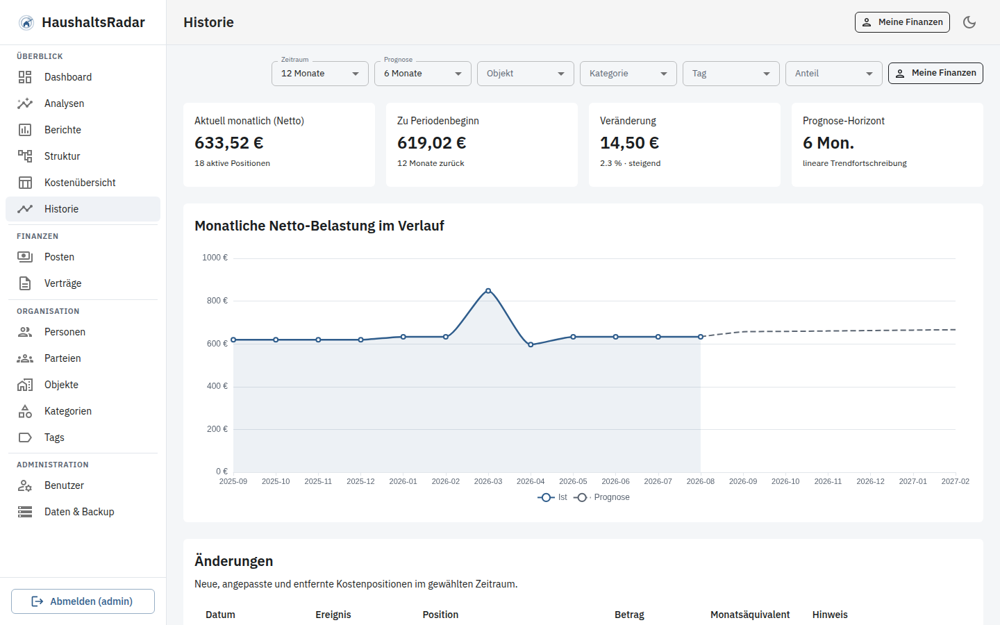

## Tipps

- Filter oben auf Dashboard/Analysen wirken oft global auf die Ansicht – bei „falschen“ Zahlen zuerst Filter prüfen.
- Einnahmen reduzieren das Netto; Ausgaben erhöhen die Fixkosten.
- Dark Mode: Mond-/Sonnen-Symbol in der Kopfzeile.
- Als PWA kannst du die App auf dem Gerät „installieren“, sofern der Browser das anbietet.

## Hilfe bei fehlenden Rechten

Siehst du Menüpunkte wie **Posten** oder **Benutzer** nicht, fehlt dir die passende Rolle. Bitte den Admin um eine Anpassung.
